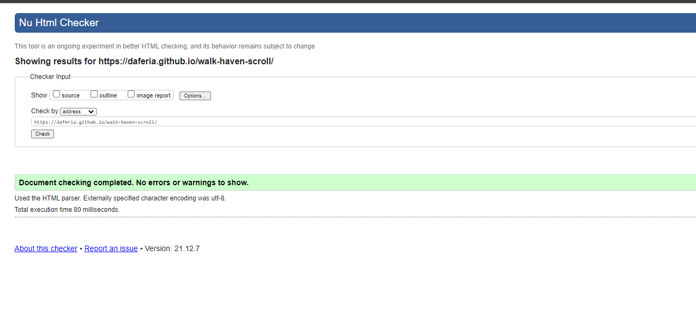
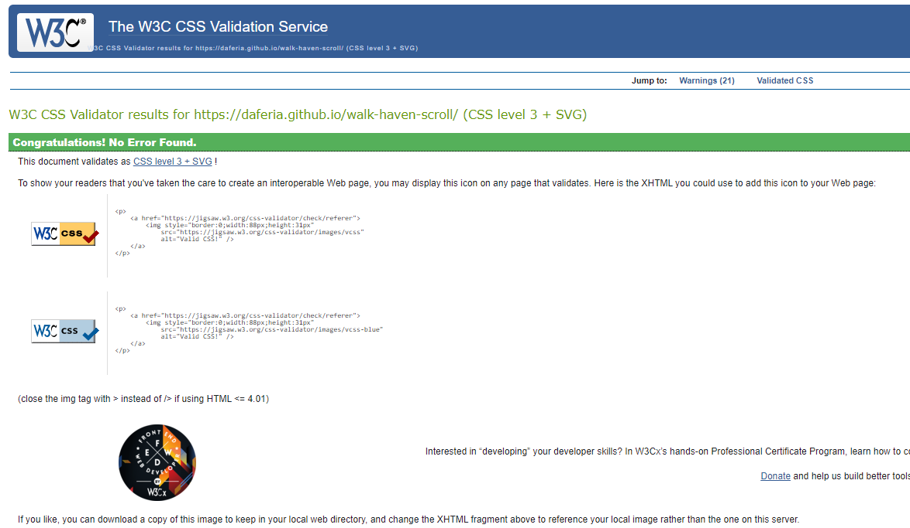

# Walk Haven - Dog Park

# Goal for this Project
Welcome to Walk Haven - Dog Park Webiste.

This site is to provide information about somewhere where owners and their best friends can feel at home.
Visitors will have the abilty to contact Walk haven through a contact form.

# Table of Contents
* [UX](#ux "UX")
    * [User Goals](#user-goals "User Goals")
    * [User Stories](#user-stories "User Stories")
    * [Site Owners Goals](#site-owners-goals)
    * [User Requirements and Expectations](#user-requirements-and-expectations)
         * [Requirements](#requirements)
         * [Expectations](#expectations)
     * [Design Choices](#design-choices)
        * [Fonts](#fonts)
        * [Icons](#icons)
        * [Colours](#colours)
        * [Structure](#structure)
    * [Wireframes](#wireframes)
    * [Features](#features)
        * [Existing Features](#existing-features)
            * [Navigation Bar](#navigation-bar)
            * [Landing Page](#landing-page)
            * [About Section](#about-section)
            * [Events Section](#events-section)
            * [Contact Section](#contact-section)
            * [Footer](#footer)
        * [Future Features](#future-features)
    * [Technologies used](#technologies-used)
        * [Languages](#languages)
        * [Tools and Libraries](#tools-and-libraries)
    * [Testing](#testing)
        * [Unfixed Bugs](#unfixed-bugs)
    * [Deployment](#deployment)
    * [Credits](#credits)
# UX

## User Goals
* Visually appealing, including images.
* Easily navigated around on single page but feel like a multi-page layout.
* Quality and valuable content.
* Easily found contact form.
* Quick footer links to social media.

## User Stories
* As an End User, I want to be infomred of how the park came to be.
* As an End User, I want to be able to easily contact the the site owner/meet-up organiser.
* As an End User, I want to be able to make contact with us via several different methods, i.e. social media.
* As an End User, I want to be able to easily navigate through the website.
* As an End User, I want to know where the park is situated and directions.

## Site owners Goals
* Promote the park by getting user to see what we are about.
* Increase the number of volunteers and park visitors.

### Requirements
* Easy to navigate on various screen sizes.
* Clear information on the parks services.
* Keep the user interested with small chunks of information and well organised gallery.
* Easy and Clear way of contacting the park.

### Expectations
* I expect to know if a form has been submitted properly and if items are not filled in, to be prompted.
* I expect all links to social media sites to be opened in a new tab.
* I expect all navigation links to work correctly.
* I expect screen size not to affect the quality of the website.
* I expect all information to be correct and accurate.

\
&nbsp;
[Back to Top](#table-of-contents)
\
&nbsp;

## Design Choices

### Fonts
I have used [Google Fonts](https://fonts.google.com/ "Google Fonts") to find a text that best suits the feel of the website.
I have mostly used "Arima Madurai" and "Roboto" for most of the site. "Robot" will be used for the Body and "Arima Madurai" for the the logo.

### Icons
I have chosen to use the amazing icons supplied from [Font Awesome library](https://fontawesome.com/ "Font Awesome"). These icons are easy to interpret and are free to use on the website

### Colours

I have used [Coolors](https://coolors.co/ "coolors") to generate a suitable palette for my colour scheme. 

I will explain the uses of the varius colours below, starting from top to bottom.

 
 * --china-pink: #d87093;
 * --honeydew: #f1faee;
 * --beige: #f1f3e0;
 * --dutch-white: #f1e4c3;
 * --wheat: #f0dcb4;

### Structure

I have decided to use CSS Grid and Flex for creating a resposive layout over Bootstrap. I preferred CSS Grid for main drif layout and flexbox due to the flexibilty (no pun intended) in styling a "grid in a grid" layout for the webiste and to overly worry about the Specifity issue created by importing the bootstrap library.

\
&nbsp;
[Back to Top](#table-of-contents)
\
&nbsp;

# Wireframes

I originally created these by hand on paper which allowed me to be more productive in case i needed to change things last minute. I then transfered these to [Balsamic](https://balsamiq.com/wireframes/ "Balsamic") to create my wireframes for my website

The wireframes are below:

### [Desktop Wireframe]( "Desktop wireframe")
### [Tablet Wireframe]( "Tablet wireframe")
### [Phone Wireframe]( "Phone wireframe")

\
&nbsp;
[Back to Top](#table-of-contents)
\
&nbsp;

# Features

+ The main feature I think is the Gallery and the layout used.
+ One page scrolling with 3 sections making it feel as a 3 page website.
+ Contact form with video

### Navigation Bar

The navigation bar is fully responsive and even though it is a single page it still feels as a multiple page website. It includes links to hover pseudo elements and by limiting the links to three, makes for a relaxed and easy navigation experience.
\
&nbsp;

+ Desktop (>=771px)
\
&nbsp;

+ Small devices (<480px)
\
&nbsp;

\
&nbsp;
[Back to Top](#table-of-contents)
\
&nbsp;

### Landing Page and Welcome Page

+ The Home/Landing page image
   - General Welome page with a brief Welcome to the site. 
   - Hero Image as well as a logo.

### Gallery

+ Collection of images taken mostly from Unsplash
  - random pictures of pets and people walking their dogs.

### About Section

+ This section is broken down into small bite size chucks on information as well as Our Story on how Walk Haven came to be
  - This section includes: Our Mission, Park Location and Hours
  - Image of a family bathing the beloved pet
  - Our Story
  - Volunteers Infomration
  - Hours

### Contact Section

+ Simple and well styled form for General Enquiries, Volunteering and Complaints

### Footer

+ The footer will contain the links to all my social media.

## Future Features
+ I plan to continue to add more features as I learn new technologies through out the course.
+ I plan to add a Google Maps API so that the End user can easily navigate to the park at a click of a button.
+ add form Modal in place os the embed form currently on the site.

\
&nbsp;
[Back to Top](#table-of-contents)
\
&nbsp;

# Technologies used

## Languages
* [HTML](https://en.wikipedia.org/wiki/HTML "HTML")
* [CSS](https://en.wikipedia.org/wiki/CSS "CSS")

## Libraries & Framework
* [Google Fonts](https://fonts.google.com/ "Google Fonts")
* [Font Awesome library](https://fontawesome.com/ "Font Awesome")

## Tools
* [Github](https://github.com/ "Github")
* [Gitpod](https://www.gitpod.io/ "Gitpod")
* [Balsamic](https://balsamiq.com/wireframes/ "Balsamic")
* [W3C HTML Validation Service](https://validator.w3.org/ "W3C HTML")
* [W3C CSS Validation Service](https://jigsaw.w3.org/css-validator/ "W3C CSS")
* [Coolors](https://coolors.io/ "coolors")
* [Font Awesome library](https://fontawesome.com/ "Font Awesome")
* [Google Fonts](https://fonts.google.com/ "Google Fonts")
* [Unsplash](https://unsplash.com/ "Unsplash")
* [iloveimg](https://www.iloveimg.com/resize-image#resize-options,percentage "iloveimg")

\
&nbsp;
[Back to Top](#table-of-contents)
\
&nbsp;

# Testing

* on testing the stie I found the images really slowed the site down. I used a site called
[iloveimg](https://www.iloveimg.com/resize-image#resize-options,percentage "iloveimg") to compress the files sizes for better rendering on loading the page.

* Also when the site was three separate pages it would load the gallery really slowly which made for a unpleasant user experience. Changing it to one scrolling page made it a lot better to navigate.

+ I wanted to incorporate a modal for a contact form instead of a embebed form on the page. When trying to style it it would cause issues when in small viewports. As it was a CSS only modal i decided to wait for further learning and possibl add the feature in version 2 of the site.

+ W3 HTMl Validation

+ W3 CSS Validation

## Unfixed Bugs

+ Issue with form overflow on extremely small displays at <150px. Also some of th pading in the different screens sizes have difficult to get working 100% the way i wanted. Unless pointed out it should not affect the overall UX.

# Deployment

This project is deployed by using Github.
+ After coding and style the site, I used the Github pages to generate the URL - https://daferia.github.io/walk-haven-scroll/

\
&nbsp;
[Back to Top](#table-of-contents)
\
&nbsp;

# Credits

For code insperation, help and advice,
* [Simen Daehlin](https://github.com/Eventyret "Simen Daehlin")
* [Christopher Rees](https://portfolio.christopher-rees.co.uk/ "Christopher Rees")

## image credits and location

+ Most of my images were from a person call Chewy. I found his/her images really expressed what i was trying to achieve.

  - [Humphrey Muleba](https://unsplash.com/@good_citizen "Humphrey Muleba")
  - [Sam Manns](https://unsplash.com/@sammanns94 "Sam Manns")
  - [Marcus Cramer](https://unsplash.com/@marcuslcramer "Marcus Cramer")
  - [Chewy](https://unsplash.com/@chewy "Chewy")

## For content and style insperation

* [CSS-Tricks - A Complete Guide to Flexbox](https://css-tricks.com/snippets/css/a-guide-to-flexbox/ "CSS-Tricks - A Complete Guide to Flexbox")
* [W3 Schools](https://www.w3schools.com/ "W3 Schools")
* [Kevin Powell](https://www.youtube.com/kepowob "Kevin Powell")

\
&nbsp;
[Back to Top](#table-of-contents)
\
&nbsp;