# Walk Haven - Dog Park

# The Goal for this Project

Welcome to Walk Haven - Dog Park Website.

This site is to provide information about somewhere where owners and their best friends can feel at home. Visitors will have the ability to contact Walk haven through a contact form.

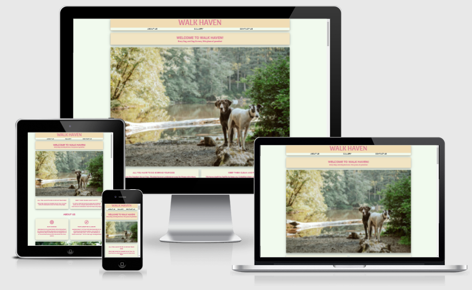

# Table of Contents

+ [UX](#ux "UX")
    + [User Goals](#user-goals "User Goals")
    + [User Stories](#user-stories "User Stories")
    + [Site Owners Goals](#site-owners-goals)
    + [Requirements](#requirements)
    + [Expectations](#expectations)
    + [Design Choices](#design-choices)
        + [Fonts](#fonts)
        + [Icons](#icons)
        + [Colours](#colours)
        + [Structure](#structure)
    + [Wireframes](#wireframes)
    + [Features](#features)
        + [Existing Features](#existing-features)
            + [Navigation Bar](#navigation-bar)
            + [Landing Page](#landing-page)
            + [About Section](#about-section)
            + [Events Section](#events-section)
            + [Contact Section](#contact-section)
            + [Footer](#footer)
        + [Future Features](#future-features)
    + [Technologies used](#technologies-used)
        + [Languages](#languages)
        + [Tools and Libraries](#tools-and-libraries)
    + [Testing](#testing)
        + [Unfixed Bugs](#unfixed-bugs)
    + [Deployment](#deployment)
    + [Credits](#credits)
# UX

## User Goals

+ Visually appealing, including images.
+ Easily navigated around on a single page but feel like a multi-page layout.
+ Quality and valuable content.
+ Easily find contact form.
+ Quick footer links to social media.

## User Stories

+ As a User, I want to be informed of the story of how the park came to be.
+ As a User, I want to be able to easily contact the site owner using a simple contact form.
+ As a User, I want to be able to contact and follow us via social media.
+ As a User, I want to be able to easily navigate through the website.
+ As a User, I want to know where the park is situated, its opening hours and its location.

## Site Owners Goals

+ Promote the park by getting the user to see what we are about.
+ Increase the number of volunteers and park visitors.

## Requirements

+ Easy to navigate on various screen sizes.
+ Clear information on the parks services.
+ Keep the user interested with small chunks of information and well organised gallery.
+ Easy and clear way of contacting the park.

## Expectations

+ I expect to know if a form has been submitted properly and if items are not filled in, to be prompted.
+ I expect all links to social media sites to be opened in a new tab.
+ I expect all navigation links to work correctly.
+ I expect screen size not to affect the quality of the website.
+ I expect all information to be correct and accurate.

\
&nbsp;
[Back to Top](#table-of-contents)
\
&nbsp;

## Design Choices

### Fonts
I have used [Google Fonts](https://fonts.google.com/ "Google Fonts") to find a text that best suits the feel of the website.
I have mostly used ++Arima Madurai++ and ++Roboto++ for most of the site. ++Roboto++ will be used for the Body and ++Arima Madurai++ for the logo.

### Icons
I have chosen to use the amazing icons supplied from [Font Awesome library](https://fontawesome.com/ "Font Awesome"). These icons are easy to interpret and are free to use on the website

### Colours

I have used [Coolors](https://coolors.co/ "coolors") to generate a suitable palette for my colour scheme. 

I will explain the uses of the various colours below, starting from top to bottom

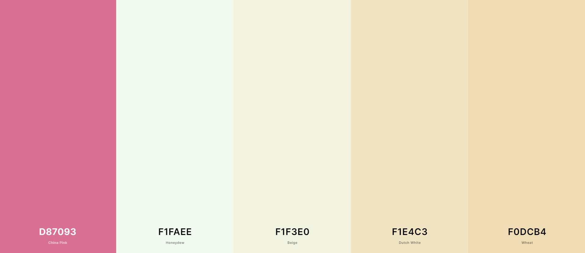
 
 + --china-pink: #d87093;
   * Used for the **Fonts**, **Hover Effects** and **Links** colour
 + --honeydew: #f1faee;
   * Used for the **Body** background colour
 + --beige: #f1f3e0;
   * Used for the **Box** background colour
 + --dutch-white: #f1e4c3;
   * Used for the **Main Heading** box
 + --wheat: #f0dcb4;
   * Used for the **Header** and **Footer** background colour

### Structure

I have decided to use **CSS Grid** and **Flexbox** for creating a responsive layout over **Bootstrap**. I preferred **CSS Grid** for the main grid layout and **Flexbox** due to the flexibility (no pun intended) in styling a "grid within a grid" layout for the website and to overly worry about the Specificity issue created by importing the **Bootstrap** library.

\
&nbsp;
[Back to Top](#table-of-contents)
\
&nbsp;

# Wireframes

I originally created these by hand on paper which allowed me to be more productive in case I needed to change things last minute. I then transferred these to [Balsamic](https://balsamiq.com/wireframes/ "Balsamic") to create the wireframes for my website.

The wireframes are below:

## Desktop Wireframe

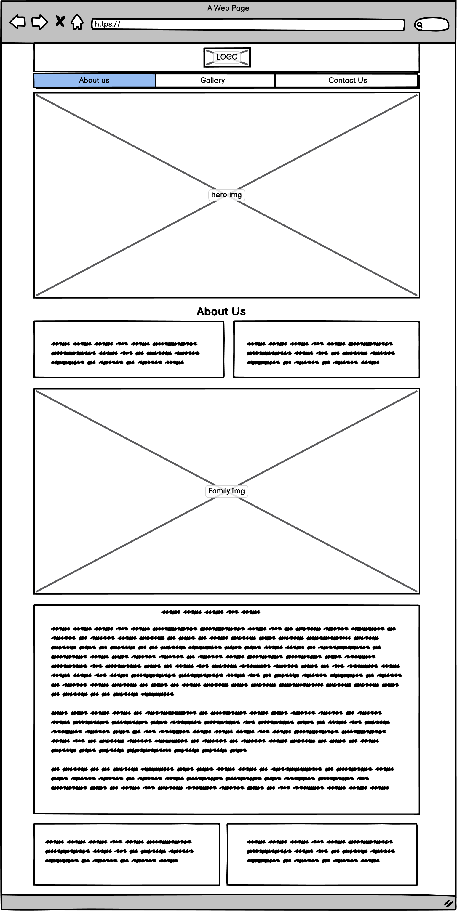
\
&nbsp;
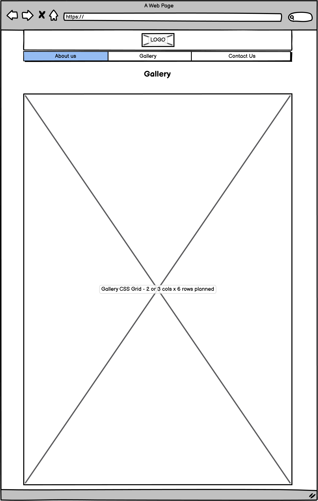
\
&nbsp;
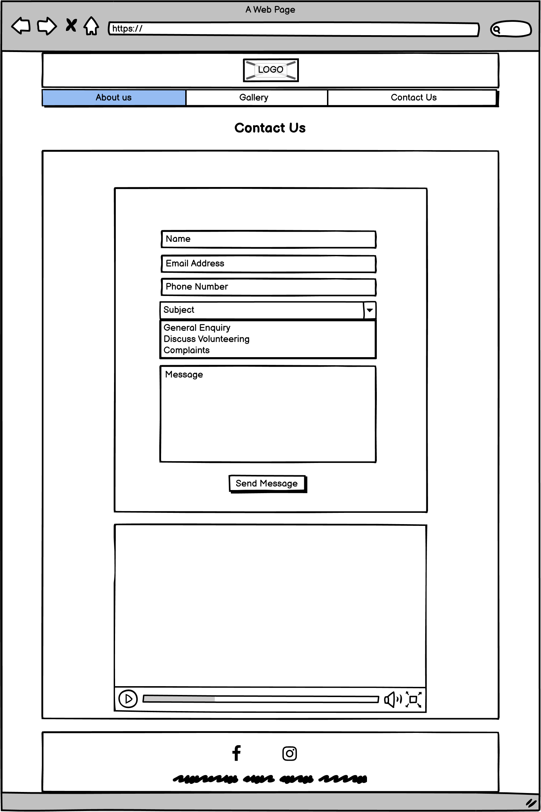

## Phone Wireframe

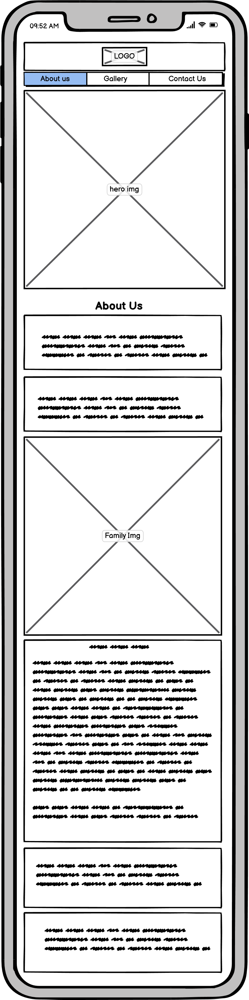
\
&nbsp;
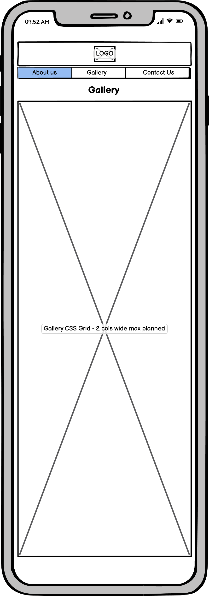
\
&nbsp;
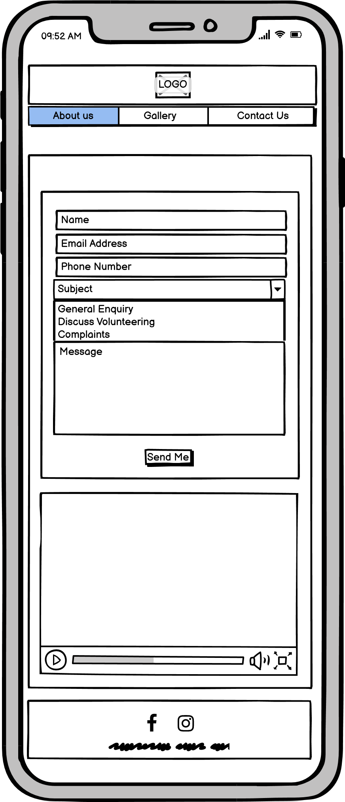

\
&nbsp;
[Back to Top](#table-of-contents)
\
&nbsp;

# Features

+ The main feature I think is the Gallery and the layout used.
+ One page scrolling with 3 sections making it feel as a 3-page website.
+ Contact form with video

### Navigation Bar

The navigation bar is fully responsive and even though it is a single page it still feels as a multiple page website. It includes links to hover pseudo elements and by limiting the links to three, makes for a relaxed and easy navigation experience.
\
&nbsp;

+ Desktop (>=771px)
\
&nbsp;
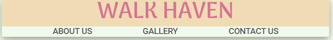

+ Small devices (<480px)
\
&nbsp;
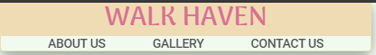

\
&nbsp;
[Back to Top](#table-of-contents)
\
&nbsp;

### Landing Page and Welcome Page

+ The Home/Landing page image
   - General Welcome page with a brief Welcome to the site. 
   - Hero Image as well as a logo.

### Gallery

+ Collection of images taken mostly from Unsplash
  - Random pictures of pets and people walking their dogs.
  - Well organised grid layout that is fully responsive at any viewport.
  - Images are really good quality adding to the over clean and clear feel to the site.

### About Section

+ This section is broken down into small bite size chucks on information as well as Our Story on how Walk Haven came to be
  - This section includes: Our Mission, Park Location and Hours
  - Image of a family bathing the beloved pet
  - Our Story
  - Volunteers Information
  - Hours

### Contact Section

+ Simple and well styled form for General Enquiries, Volunteering and Complaints

+ Added a video to the end on the contact section as I found that it added a good send off to mark the end of the contact section.

### Footer

+ The footer contains the links to all my social media.

## Future Features

+ I plan to continue to add more features as I learn new technologies throughout the course.
+ I plan to add a Google Maps API so that the End user can easily navigate to the park at a click of a button.
+ Add a modal in place of the embed form currently on the site.

\
&nbsp;
[Back to Top](#table-of-contents)
\
&nbsp;

# Technologies used

## Languages

+ [HTML](https://en.wikipedia.org/wiki/HTML "HTML")
+ [CSS](https://en.wikipedia.org/wiki/CSS "CSS")

## Libraries & Framework

+ [Google Fonts](https://fonts.google.com/ "Google Fonts")
+ [Font Awesome library](https://fontawesome.com/ "Font Awesome")

## Tools
+ [Github](https://github.com/ "Github")
+ [Gitpod](https://www.gitpod.io/ "Gitpod")
+ [Balsamic](https://balsamiq.com/wireframes/ "Balsamic")
+ [W3C HTML Validation Service](https://validator.w3.org/ "W3C HTML")
+ [W3C CSS Validation Service](https://jigsaw.w3.org/css-validator/ "W3C CSS")
+ [Coolors](https://coolors.io/ "coolors")
+ [Font Awesome library](https://fontawesome.com/ "Font Awesome")
+ [Google Fonts](https://fonts.google.com/ "Google Fonts")
+ [Unsplash](https://unsplash.com/ "Unsplash")
+ [Pexels](https://www.pexels.com/ "Pexels")
+ [iloveimg](https://www.iloveimg.com/resize-image#resize-options,percentage "iloveimg")

\
&nbsp;
[Back to Top](#table-of-contents)
\
&nbsp;

# Testing

## Gallery

+ I planned to have a 6 column grid large screen and 1 column on mobile screens

  - On testing the 6 columns I found the images were too condensed and caused the grid to look overcrowded.

  - On the mobile screen with 1 column, I found that the gallery seemed a little longer than it needed to be. I asked the family for their input, and they agreed.

  - The result was not what I found was the aim and decided to change it to a 4 column on a larger screen and 2 columns on mobile.

  - There was a noticeably better user experience on the mobile view as I was able to position larger height images along with each other which allowed for a shorter yet more user-friendly experience.

  - When adding the images originally i had to spend a lot of time positioing the images. I then chose to use a masonry type of layout that is fully responsive to any screen size.

  - After adding the images, and getting the correct layout, I noticed that the load times of the site were too slow.

  - The sizes of the images were on average 3mb each.

  - I decided to compress the images with a site called [iloveimg](https://www.iloveimg.com/resize-image#resize-options,percentage "iloveimg"). Images were able to be reduced by 88% without it affecting the quality of the images.

## Form

+ I wanted to incorporate a modal for a contact form instead of an embedded form on the page. When trying to style it would cause issues when in small viewports. As it was a CSS only modal I decided to wait for further learning and possibly add the feature in version 2 of the site.

+ The form went through a few versions due to the width of the site and the different versions of the form 

+ I wanted to remove the labels from the form but after doing some research I could not get a clear answer on the accessibility guidelines as well as a consensus on it. I decided to keep the labels on the form and style them as per the Website colour palette.

## Additional Testing

+ W3 HTML Validation
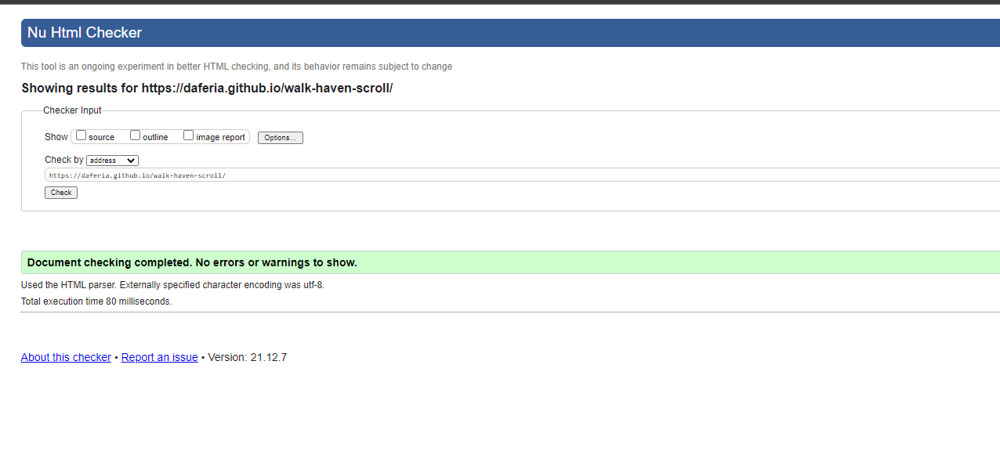

+ W3 CSS Validation
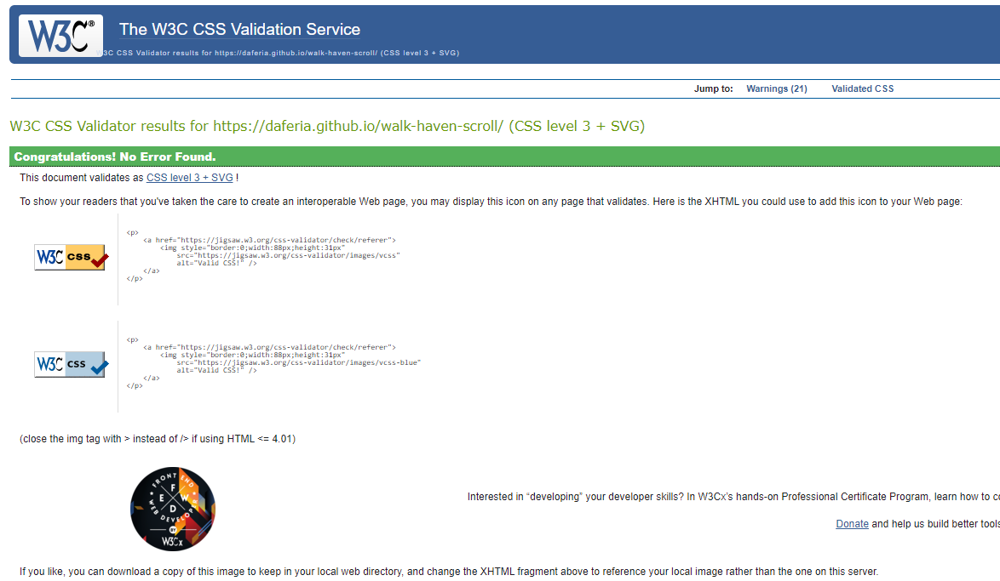

## Unfixed Bugs

+ An issue with form overflow on extremely small displays at <250px. Also, some of the margins in the different screen sizes have been difficult to get working 100% the way I wanted. Unless pointed out it should not affect the overall UX.

## Deployment

Following writing the code then committing and pushing to GitHub, this project was deployed using GitHub by the following steps.

+ Navigate to the repository on GitHub and click 'Settings'.
+ Then select 'Pages' on the side navigation.
+ Select the 'None' dropdown, and then click 'master'.
+ Click on the 'Save' button.
+ Now the website is live on https://daferia.github.io/walk-haven-scroll
+ If any changes are required, they can be done, committed and pushed to GitHub and the changes will be updated.

\
&nbsp;
[Back to Top](#table-of-contents)
\
&nbsp;

# Credits

For code inspiration, help and advice,
+ [Simen Daehlin](https://github.com/Eventyret "Simen Daehlin")
+ [Christopher Rees](https://portfolio.christopher-rees.co.uk/ "Christopher Rees")

## Image Credits

 Most of my images were from a photographer called **Chewy**. I found their images really expressed what I was trying to achieve. I also used a video from **Kelly Lacy** found on **Pexels**. I did contact all the people mentioned in the below credits for permission to use thier material. It was confirmed by all of them.

  - Images
    - [Humphrey Muleba](https://unsplash.com/@good_citizen "Humphrey Muleba")
    - [Sam Manns](https://unsplash.com/@sammanns94 "Sam Manns")
    - [Marcus Cramer](https://unsplash.com/@marcuslcramer "Marcus Cramer")
    - [Chewy](https://unsplash.com/@chewy "Chewy")
  - Video
    - [Kelly Lacy](https://www.pexels.com/@kelly-l-1179532 "Kelly Lacy")

## For content and style inspiration

+ [CSS-Tricks - A Complete Guide to Flexbox](https://css-tricks.com/snippets/css/a-guide-to-flexbox/ "CSS-Tricks - A Complete Guide to Flexbox")
+ [W3 Schools](https://www.w3schools.com/ "W3 Schools")
+ [Kevin Powell](https://www.youtube.com/kepowob "Kevin Powell")

\
&nbsp;
[Back to Top](#table-of-contents)
\
&nbsp;